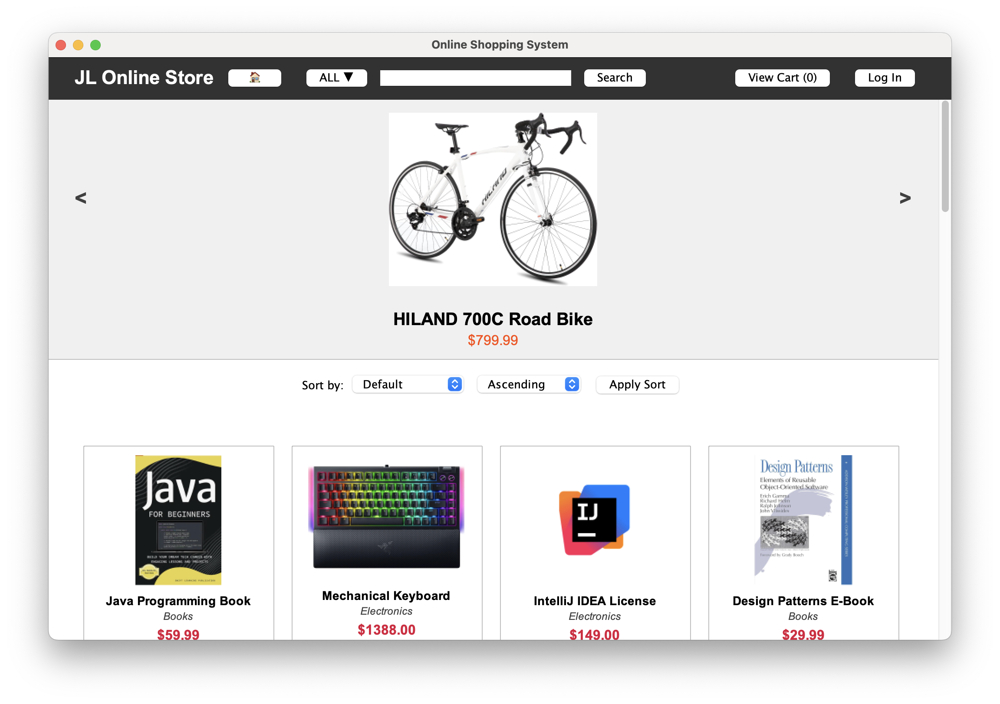
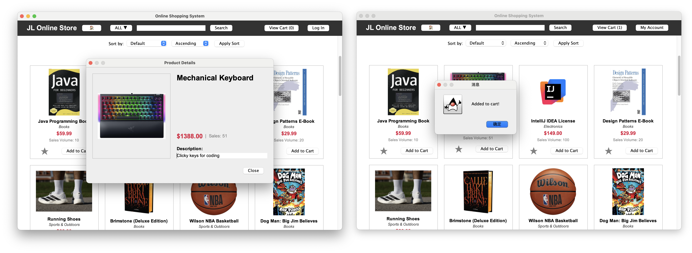
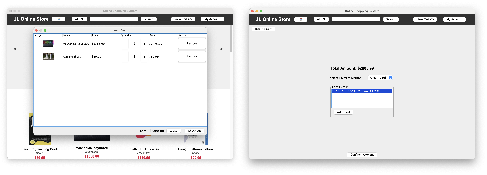
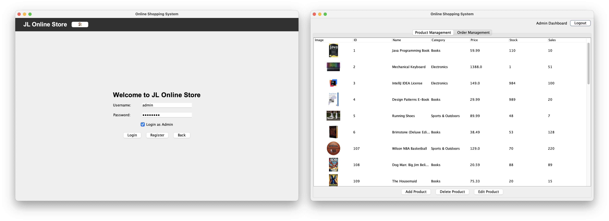

# JL Online Shopping System (COMP603 Project)

A comprehensive desktop-based Online Shopping System commissioned for the **COMP603 Program Design & Construction** course. This project allows users to browse products, manage a shopping cart, and process secure payments, while providing administrators with powerful tools for inventory and order management.

**Team**: Group 12 \\
**Course**: COMP603 Program Design & Construction \\
**Project**: Online Shopping System (Java/Swing/Derby)

---

## 1. Title and Overview

### **JL Online Shopping System**


The **JL Online Shopping System** is a robust Java Swing application designed to simulate a real-world e-commerce platform. It seamlessly connects Customers with Products through an intuitive interface, backed by a persistent embedded database.

**Key Goals:**
*   To demonstrate advanced **Object-Oriented Programming (OOP)** concepts.
*   To implement a **User-Friendly GUI** using Java Swing.
*   To ensure **Data Persistence** using an embedded Apache Derby database.
*   To adhere to **SOLID Principles** and **Design Patterns** for maintainable code.

---

## 2. Features & Functionality

This application supports two distinct user roles: **Customer** and **Admin**, each with tailored functionality.

### **Core Features:**
*   **User Authentication**: Secure Login and Registration system with input validation and role-based access control.
*   **Product Management (Admin)**: Full CRUD (Create, Read, Update, Delete) capabilities for managing inventory, including image support and categories.
*   **Shopping Experience (Customer)**:
    *   **Browsing**: View products with details, images, and prices.
    *   **Search & Filter**: Find products by name or category.
    *   **Shopping Cart**: Add items, update quantities, and remove items with real-time total calculation.
    *   **Wishlist**: Save items for later.

    
*   **Checkout System**:
    *   Multiple Payment Methods: **Credit Card** and **Digital Wallet**.
    *   Order History: View past orders and status.

    

*   **Admin Dashboard**: comprehensive view of all products and system status.

    

### **Complexity & Usability:**
*   **Robust Error Handling**: The application is designed to never crash. Invalid inputs (e.g., negative text in price fields, SQL injection attempts) are caught and handled with user-friendly error messages (pop-ups). IOExceptions and SQLExceptions are logged and managed gracefully.
*   **Dynamic UI**: The interface uses `GridBagLayout` and custom renderers to adapt to different window sizes and data states.

---

## 3. Setup and Installation

This project is configured for **Zero-Configuration** execution.

### **Prerequisites**
*   **JDK 21** or higher
*   **NetBeans IDE 23**
*   **Maven** 3.x

### **Step-by-Step Guide**

1.  **Clone the Repository**
    ```bash
    git clone https://github.com/Justmao1/JLOnlineShoppingSystem.git
    ```

2.  **Open in NetBeans**
    *   Launch NetBeans 23.
    *   Go to `File` -> `Open Project`.
    *   Select the `JLOnlineShoppingSystem` folder (Maven icon).

3.  **Run the Application**
    *   Right-click the project -> `Clean and Build`.
    *   Right-click the project -> `Run`.
    *   *Alternative (Terminal)*:
        ```bash
        mvn clean install
        mvn exec:java -Dexec.mainClass="com.comp603.shopping.Main"
        ```

**✅ Automatic Setup**: The database (`shopping_db`) is **automatically created and populated** with seed data on the first launch. No manual SQL scripts or JAR imports are needed.

### **Login Credentials**
Use these default accounts to test the system:

| Role | Username | Password |
| :--- | :--- | :--- |
| **Admin** | `admin` | `admin123` |
| **Customer** | `user123` | `user12345` |

---

## 4. Database Design and Interaction

### **Database Engine**
*   **Apache Derby (JavaDB)**: Used in **Embedded Mode**. The database files reside locally within the project directory, ensuring portability.

### **Database Structure**
The system uses a Relational Schema with the following key tables:
*   **USERS**: Stores user credentials, roles, and wallet balances.
*   **PRODUCTS**: Stores item details, stock levels, prices, and categories.
*   **ORDERS**: Tracks order IDs, dates, and total amounts.
*   **ORDER_ITEMS**: Links Orders to Products (Many-to-Many relationship).
*   **WISHLIST**: Stores user's saved items.

### **Interaction & Operations**
*   **JDBC (Java Database Connectivity)**: All interactions are handled via standard JDBC.
*   **DBManager**: A Singleton class that handles connection pooling and schema initialization.
*   **Data Access Objects (DAOs)**: Each entity (`User`, `Product`, `Order`) has a dedicated DAO class to handle SQL operations, keeping the business logic clean.

---

## 5. Software Design & Implementation

The project follows a **Layered Architecture** (Presentation, logic, Data Access), promoting Separation of Concerns.

### **Class Structure & Design Patterns**
*   **MVC Applied**:
    *   **Views**: Swing Panels (`LoginPanel`, `ProductListPanel`) in `views` package.
    *   **Models**: POJOs (`User`, `Product`) in `models` package.
    *   **Controllers**: Services (`AuthService`, `ProductService`) handling logic.
*   **Design Patterns**:
    *   **Singleton Pattern**: Applied in `DBManager` to ensure a single database connection instance.
    *   **Strategy Pattern**: Used for `PaymentStrategy` interface, allowing interchangeable payment implementations (`CreditCardStrategy`, `WalletStrategy`).
    *   **DAO Pattern**: Separates data persistence from the rest of the app (`ProductDAO`, `UserDAO`).

### **Object-Oriented Concepts**
1.  **Encapsulation**: All fields in model classes (e.g., `Product.price`, `User.password`) are `private` and accessed via public Getters/Setters.
2.  **Abstraction**: `PaymentStrategy` interface abstracts the payment processing logic.
3.  **Inheritance**: GUI components extend Swing classes (e.g., `class WalletPanel extends JPanel`).
4.  **Polymorphism**: The `CheckoutService` accepts any `PaymentStrategy`, demonstrating polymorphic behavior—treating different payment methods uniformly.

### **Coding Standards**
*   **Code Style**: Follows standard Java naming conventions (CamelCase for methods/vars, PascalCase for classes).
*   **Git/GitHub**: Version control was strictly applied, with granular commits for each feature implementation.

---

## 6. User Interface (GUI)

*   **Design Philosophy**: "Clean, Modern, and Responsive".
*   **Implementation**: Used Java Swing with customized components.
*   **Layouts**: Extensively used `GridBagLayout` and `BorderLayout` to ensure the application looks good on any screen size.
*   **Feedback**: Visual feedback (Dialogs, Status Labels) is provided for every user action (e.g., "Added to Cart", "Payment Successful").

---

## 7. Unit Testing

The project uses the **JUnit 5 Framework** to ensure reliability. Over 5 critical test cases are implemented:

1.  **`AuthServiceTest`**: Verifies login logic, password validation, and user registration.
2.  **`ShoppingCartTest`**: Tests adding items, calculating totals, and clearing the cart.
3.  **`WalletStrategyTest`**: tests the deduction of funds and insufficient balance handling.
4.  **`ProductTest`**: Tests product model integrity and validation.
5.  **`UserTest`**: Verifies user data handling and role assignment.

---

## 8. Group Contribution

| Student ID | Name | Contribution |
| :--- | :--- | :--- |
| **25305764** | **Zhekai Mao** | **Core Architecture**: Implemented the main Checkout flow, Wallet system, and Product List panel. Integrated Payment System and handled major refactoring. |
| **25307126** | **Changpeng Shi** | **Database & Assets**: Managed `schema.sql`, database seeding, and product assets. Implemented product filtering/sorting. |
| **25307952** | **Haozhe Feng** | **GUI Customization**: Implemented custom Cart Dialog, improved layouts, and JTable rendering. |
| **25307695** | **Peng Ke** | **User Management**: Implemented Registration Dialog, Header panel refactoring, and client-side validation. |

*(Please see the attached `contribution.pdf` for full details)*
